# SberTech_Jenkins_lab

0. Решила проблему остановки sonarqube:
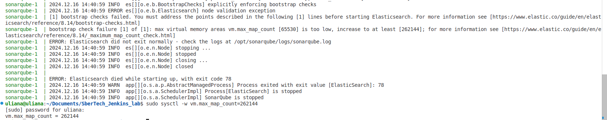

1. Поскольку изначально я выбрала базовую установку Jenkins, необходиые плагины (Docker, Allure, Sonarqube) не были установлены. Установила их вручную в настройках плагинов:
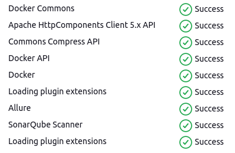

2. Установка Docker, SonarQube Scanner, Maven:
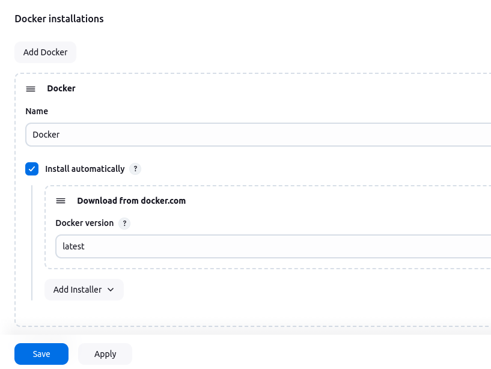
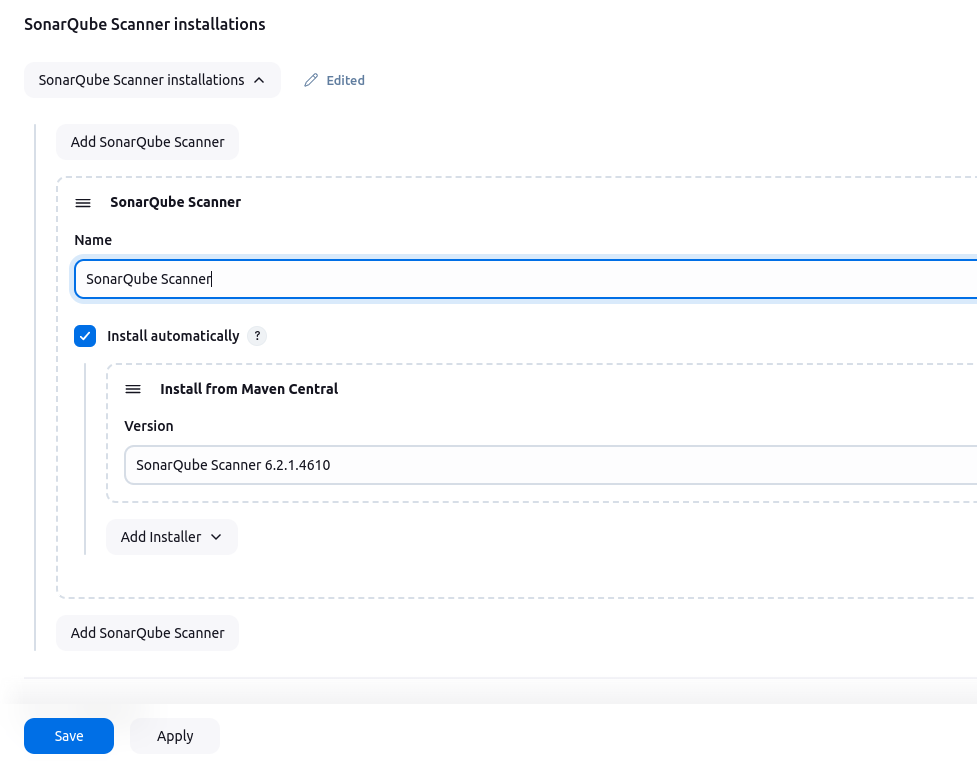
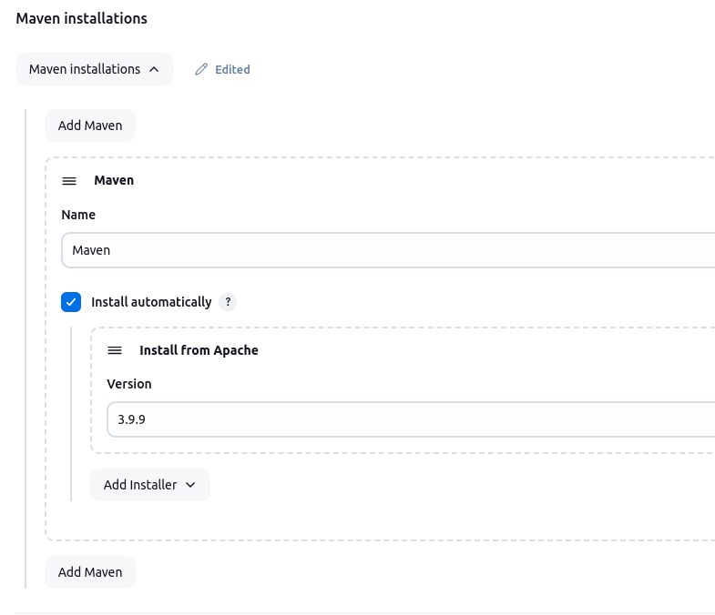

3. Добавила токен в Sonar и Jenkins:
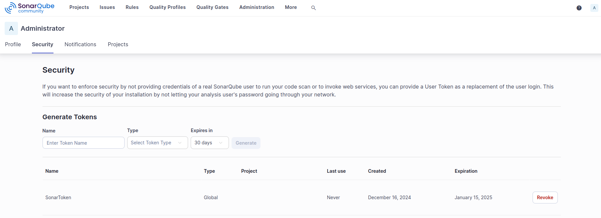
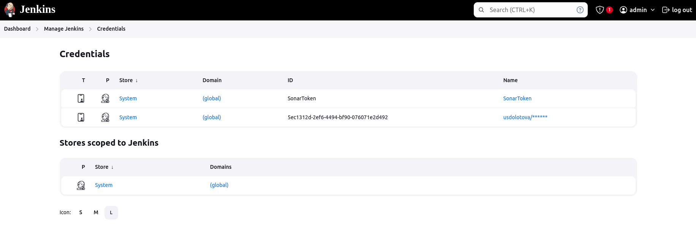

4. Настроила пайплайн следующим образом:
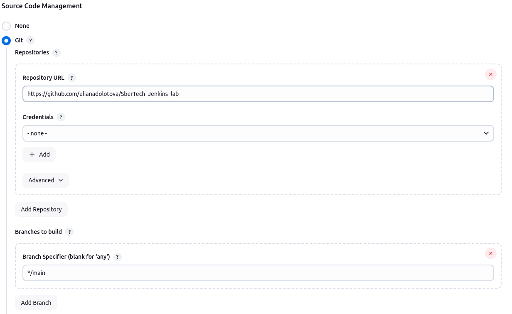
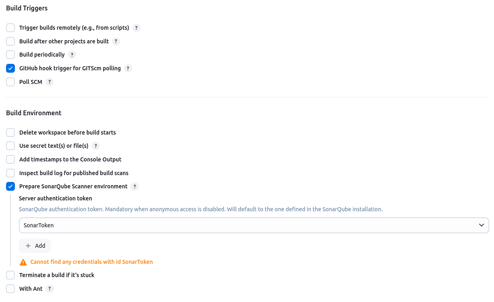
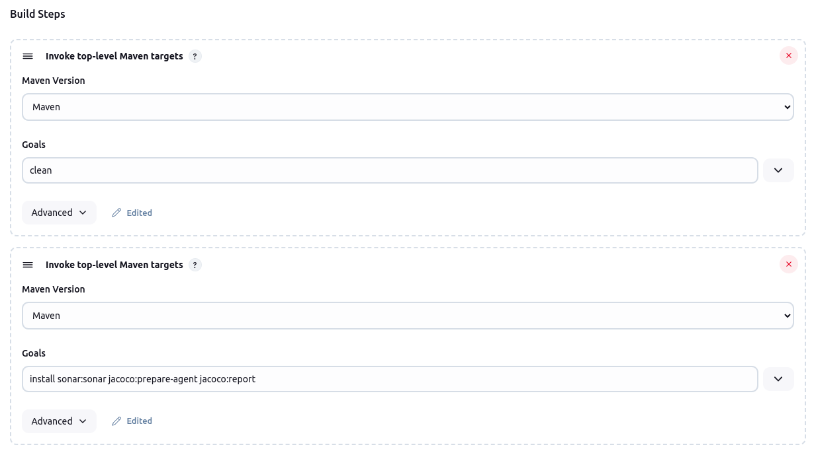
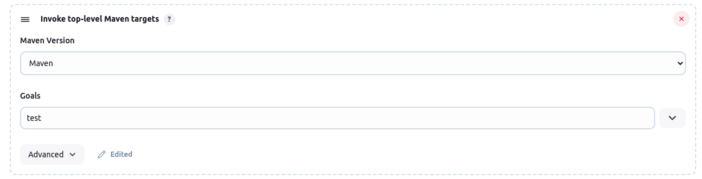
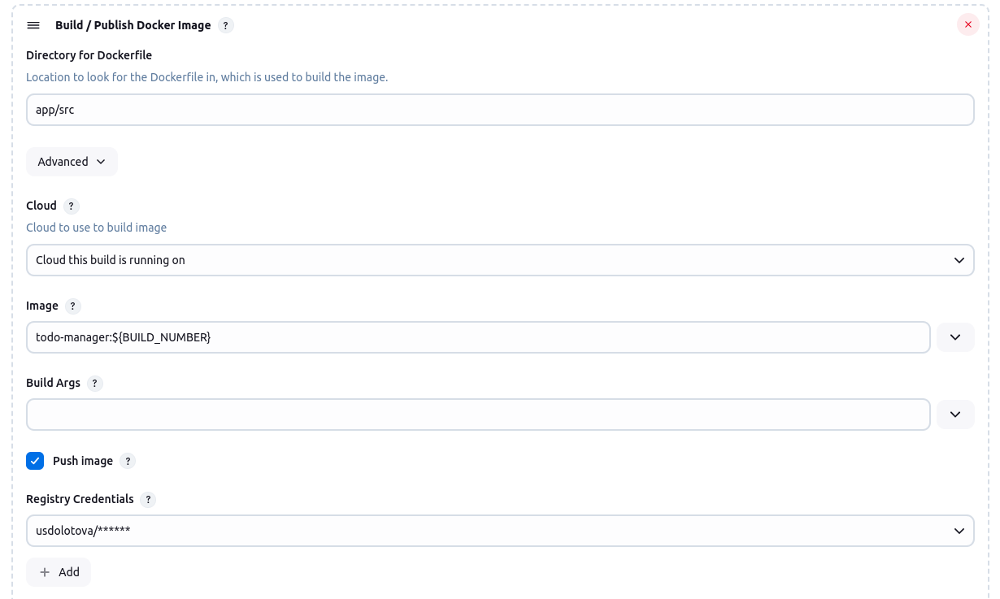

5. При этом в Sonar видно, что результаты доезжают (пайплайн проходит), но при этом данных покрытия нет.
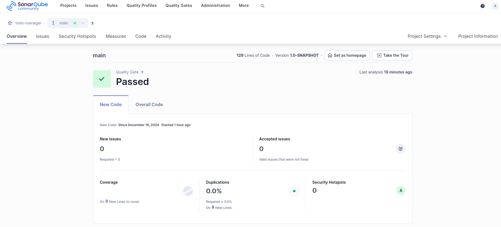